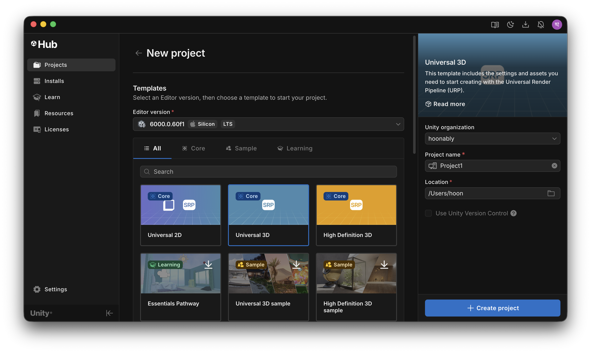
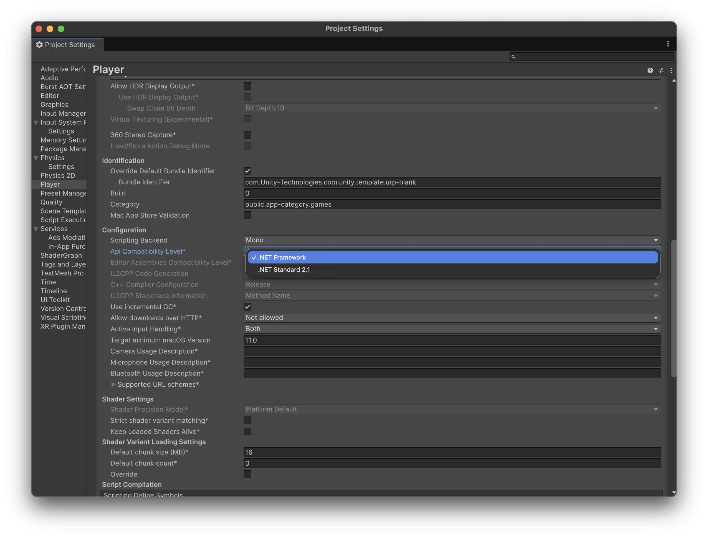

# Multi-Agent Drone Exploration

Unity-based robotics simulation projects for CSE469: Introduction to Robotics course.

## Overview

This repository contains three progressive projects exploring drone control and multi-agent coordination in Unity:

- **Project 1**: Rocket control with Arduino-based joystick input
- **Project 2**: Single drone navigation with GPS waypoints and checkpoints
- **Project 3**: Multi-agent drone exploration with autonomous path planning

## Demo

Multi-agent drone coordination system in action - showcasing autonomous deployment, path planning, and coordinated exploration.

<!-- <video src="docs/Project3_Video.mp4" width="100%" controls></video> -->

<video src="https://github.com/user-attachments/assets/2d125e4c-4e3c-4837-84d9-c4f31afa85b4" width="100%" controls></video>

## Projects

### Project 1: Rocket Control System 🏆
Arduino joystick-controlled rocket simulator with thrust and brake management.

**🥇 1st Place Winner** - Best performance among all teams in the course.

**Core Implementation**: [`ControlUnit.cs`](src/project1/ControlUnit.cs)
- Analog joystick input processing (A0-A5 ADC values)
- Digital button handling (D2-D6)
- Engine on/off toggle with dead zone filtering
- Servo-based thrust vectoring control
- Brake system management

### Project 2: GPS-based Drone Navigation
Single drone autonomous navigation through GPS waypoints with checkpoint tracking.

**Core Implementation**: [`DroneControlUnit.cs`](src/project2/DroneControlUnit.cs)
- IMU and GPS sensor simulation
- CSV-based servo timeline control
- Checkpoint detection and logging
- Real-time velocity and position tracking
- Automated brake distance calculation

### Project 3: Multi-Agent Drone Coordination
Advanced multi-drone system with automatic takeoff, landing, and coordinated exploration.

**Core Implementations**:
- [`ControlUnit.cs`](src/project3/ControlUnit.cs) - Rocket/carrier control with manual/auto modes
- [`DroneControlUnit.cs`](src/project3/DroneControlUnit.cs) - Multi-drone path planning and coordination
- [`ServoBehave.cs`](src/project3/ServoBehave.cs) - Servo actuation for drone deployment
- [`DroneSilo_behave.cs`](src/project3/DroneSilo_behave.cs) - Drone silo mechanism control

**Features**:
- Multi-drone deployment from carrier rocket
- Autonomous path planning and exploration
- Coordinated takeoff and landing sequences
- Dynamic checkpoint assignment
- Real-time multi-agent coordination

## Unity Setup

1. Create project


2. Project Settings: .NET Framework


3. Import .unitypackage file

## Directory Structure

```
├── docs/               # Project reports and documentation
├── src/
│   ├── project1/      # Rocket control system
│   ├── project2/      # GPS drone navigation
│   └── project3/      # Multi-agent coordination
├── Project1.unitypackage
├── Project2.unitypackage
└── Project3.unitypackage
```

## Acknowledgments

Based on the [CosmicMiner](https://github.com/nshbae/CosmicMiner) framework by nshbae.

## License

This repository is a personal archive of a university robotics project.
The original starter code and this repository are licensed under the MIT License.
See the LICENSE file for details.

